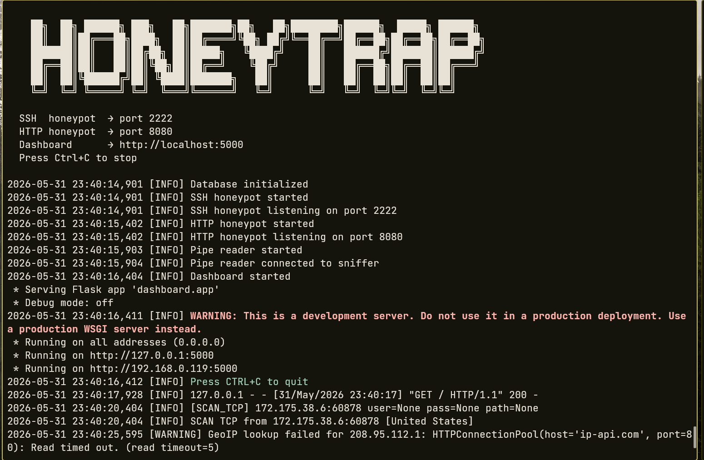
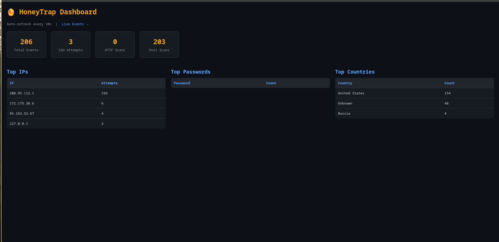

# 🍯 HoneyTrap

> A modular honeypot system for detecting and logging unauthorized access attempts.  
> Built with **Python** (core logic, servers, dashboard) and **C++** (low-level packet sniffer).


---

## 📖 About

**HoneyTrap** is an educational cybersecurity project that simulates vulnerable services (SSH, HTTP) to attract, detect, and log malicious activity. It passively monitors who is scanning or attacking your system, records their IP addresses, credentials they attempt to use, and geographical location — all visualized through a web dashboard.

The project is split into two parts:
- **Python** — fake servers, database, geolocation, web dashboard
- **C++** — high-performance raw socket packet sniffer running at the network level

> ⚠️ **For educational and research purposes only. Deploy only on systems you own or have permission to monitor.**

---

## ✨ Features

- 🔐 **Fake SSH Server** — logs every login attempt, username, password, and client fingerprint
- 🌐 **Fake HTTP Server** — detects web scanners looking for `/wp-admin`, `/phpmyadmin`, CVEs
- 📡 **C++ Packet Sniffer** — captures raw TCP/IP traffic at low level, feeds data to Python core
- 🗄️ **SQLite Database** — stores all events locally, no external dependencies
- 🌍 **GeoIP Lookup** — resolves attacker IP to country, city, ISP via ip-api.com
- 📊 **Web Dashboard** — real-time stats, attack map, top IPs, top passwords (Flask)
- 📝 **Structured Logging** — JSON logs for every event

---

## 🏗️ Architecture

```
HoneyTrap/
│
├── cpp/
│   └── sniffer.cpp          # Raw socket packet sniffer (C++)
│                            # Captures IP/TCP headers, outputs to stdout pipe
│
├── servers/
│   ├── ssh_honeypot.py      # Fake SSH server (paramiko)
│   └── http_honeypot.py     # Fake HTTP server (socket)
│
├── core/
│   ├── logger.py            # Event logger → SQLite
│   ├── geoip.py             # IP geolocation via ip-api.com
│   └── pipe_reader.py       # Reads C++ sniffer output, passes to logger
│
├── dashboard/
│   ├── app.py               # Flask web dashboard
│   └── templates/
│       ├── index.html       # Main stats page
│       └── events.html      # Live event feed
│
├── data/
│   └── honeytrap.db         # SQLite database (auto-created)
│
├── logs/
│   └── honeytrap.log        # Log file
│
├── main.py                  # Entry point — starts all modules
├── config.py                # Ports, settings, flags
└── requirements.txt         # Python dependencies
```

### Data Flow

```
Internet / Local Network
        │
        ▼
┌───────────────────┐
│  C++ Sniffer      │  ← captures ALL raw packets on the interface
│  sniffer.cpp      │    parses IP + TCP headers
└────────┬──────────┘
         │ stdout pipe
         ▼
┌───────────────────┐     ┌─────────────────────┐
│  pipe_reader.py   │────►│  logger.py + SQLite  │
└───────────────────┘     └──────────┬──────────┘
                                     │
         ┌──────────────┬────────────┘
         ▼              ▼
┌─────────────┐  ┌─────────────────┐
│ SSH Server  │  │  HTTP Server    │
│ (paramiko)  │  │  (socket)       │
└─────────────┘  └─────────────────┘
         │              │
         └──────┬───────┘
                ▼
     ┌──────────────────┐
     │  Flask Dashboard │  → http://localhost:5000
     └──────────────────┘
```

---

## 🛠️ Tech Stack

| Component        | Language | Library / Tool     |
|------------------|----------|--------------------|
| Packet Sniffer   | C++17    | Raw POSIX sockets  |
| SSH Honeypot     | Python   | `paramiko`         |
| HTTP Honeypot    | Python   | `socket`           |
| Database         | Python   | `sqlite3`          |
| Geolocation      | Python   | `requests`         |
| Web Dashboard    | Python   | `flask`            |
| Logging          | Python   | `logging`          |

---

## 🚀 Getting Started

### Requirements

- Linux (Ubuntu 20.04+ recommended)
- Python 3.10+
- GCC / G++ (for C++ sniffer)
- Root privileges (required for raw sockets)

### Installation

```bash
# Clone the repository
git clone https://github.com/yourusername/HoneyTrap.git
cd HoneyTrap

# Install Python dependencies
pip install -r requirements.txt

# Compile the C++ sniffer
g++ -std=c++17 -o cpp/sniffer cpp/sniffer.cpp

# Run (requires root for raw sockets)
sudo python main.py
```

### Configuration

Edit `config.py` to set ports and options:

```python
SSH_PORT    = 2222     # Port for fake SSH server
HTTP_PORT   = 8080     # Port for fake HTTP server
DASHBOARD_PORT = 5000  # Flask dashboard port
DB_PATH     = "data/honeytrap.db"
INTERFACE   = "eth0"   # Network interface for C++ sniffer
```

---

## 📊 Dashboard Preview

The web dashboard runs at `http://localhost:5000` and shows:

- Total attack attempts (last 24h / all time)
- Top attacking IP addresses
- Top usernames and passwords tried
- Geolocation of attackers (country, city)
- Live event feed
---
## 📸 Screenshots

### Terminal — Running HoneyTrap


### Dashboard — Live Stats

---

## 📅 Roadmap

- [x] Project architecture and README
- [x] C++ packet sniffer (`sniffer.cpp`)
- [x] SSH honeypot (`ssh_honeypot.py`)
- [x] HTTP honeypot (`http_honeypot.py`)
- [x] Logger + SQLite (`logger.py`)
- [x] GeoIP module (`geoip.py`)
- [x] Flask dashboard (`app.py`)
- [x] Main entry point (`main.py`)
- [x] Testing on local VM

---

## ⚠️ Legal Disclaimer

This project is intended **for educational purposes only**.  
Only deploy HoneyTrap on systems and networks **you own or have explicit permission to monitor**.  
The author is not responsible for any misuse.

---

## 📄 License

MIT License — see [LICENSE](LICENSE) for details.
